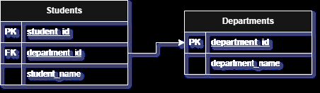
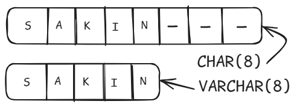

**What is the purpose of a database schema in PostgreSQL?**

Database Schema বলতে আমরা বুঝতে পারি একটা ডাটাবেসের ব্লুপ্রিন্ট বা কাঠামো। আমরা সাধারণত ডাটাবেসের টেবিলগুলোতে বিভিন্ন ধরনের ডাটা স্ট্রাকচারড ওয়েতে স্টোর করি এবং দরকারে তা রিট্রিভ করি। বড় ধরণের এপ্লিকেশনের ক্ষেত্রে এই ডাটাবেসের স্ট্রাকচার অনেক জটিল হওয়ার সম্ভবনা থাকে, তখন ডাটাবেস ম্যানেজ করা অনেকটা কষ্টসাধ্য হয়ে যায়।

    

এই সমস্যা থেকে মুক্ত হতে database schema এর কনসেপ্ট ব্যবহার হয়। একটা ডেটাবেসের টেবিলগুলো তৈরির সময়, সেগুলা কি কি ডাটা স্টোর করবে এবং ডাটাগুলোর ধরণ কি হবে তা এই স্কিমার মাধ্যমে ঠিক করে দেওয়া হয়। আবার বিভিন্ন টেবিলগুলোর মধ্যে সম্পর্ক স্থাপনের জন্য নির্দেশনা দেওয়া হয়, যেমন প্রাইমারি কি ও ফরেইন কি গুলো এবং তাদের মধ্যকার রিলেশন ঠিক করা হয়। তাহলে এই ডাটাবেস ইমপ্লিমেন্ট ও ম্যানেজ করা সহজ থেকে সহজতর হয়।

**Explain the Primary Key and Foreign Key concepts in PostgreSQL.**

আমরা ইন্ডাস্ট্রি লেভেলের প্রজেক্টগুলোতে যখন ডাটাবেস ব্যবহার করি তখন দেখা যায় অনেক সংখ্যক টেবিলের প্রয়োজন হয়। আর এই টেবিলগুলোও নিজেদের মধ্যে ইন্টারকানেক্টেড থাকে। এই ইন্টারকানেক্টিভিটি তৈরি করতে আমাদের সাধারণত দুই ধরণের key প্রয়োজন হয়, যেগুলো হল Primary Key এবং  Foreign Key । 

Primary Key  হল একটি টেবিলের প্রত্যেক সারি এর জন্য ইউনিক আইডেন্টিফায়ার। প্রাইমারি কি সাধারণত একটা কলাম অথবা একাধিক কলামের সেট আকারে ধরা হয়। যখন একটা কলাম এর ডাটা দিয়ে ওই সারিকে নির্দিষ্ট করে আইডেন্টফাই করা যায় না তখন একাধিক কলাম এর দরকার হয়। তবে যদি একাধিক কলামের ব্যবহার হয় তখন তাকে Composite Key ও বলা হয়।

Foreign Key সাধারণত একটি টেবিলের মধে অন্য একটি টেবিলের প্রাইমারি কি কে নির্দেশ করে। ফলে দুইটি টেবিলের মধে সম্পর্ক স্থাপন করা যায় এবং একটা ডাটার সাথে ম্যাচ করে অন্য টেবিল থেকে প্রয়োজনীয় ডাটা রিট্রিভ করা যায়। একটি টেবিলের মধ্যে এক বা একাধিক ফরেইন কি থাকতে পারে আবার নাও থাকতে থাকতে পারে।

    

উপরের এন্টিটি ডায়াগ্রামে, student_id ও department_id হল দুইটা টেবিলের প্রাইমারি কি এবং department_id এইক্ষেত্রে students টেবিলের জন্য ফরেইন কি। উদাহরণ হিসেবে যদি আমরা একজন স্টুডেন্টের ডিপার্ট্মেন্ট সম্পর্কে জানতে চাই তাহলে তার প্রাইমারি কি student_id দিয়ে তাকে ইউনিকলি আইডেন্টিফাই করতে পারব। এবার department_id ব্যবহার করে আমরা departments টেবিল থেকে তার department_name সহজেই বের করে ফেলতে পারব।

What is the difference between the `VARCHAR` and `CHAR` data types?

SQL ভিত্তিক ডাটাবেস এ বিভিন্ন ধরণের ডাটা টাইপ ব্যবহার হয়, যার মধ্যে স্ট্রিং জাতীয় ডাটা স্টোর করতে VARCHAR ও CHAR এই দুই ধরণের ডাটা টাইপ ব্যবহৃত হয়। যদিও এরা একই ধরণের ডাটা স্টোর করে, কিন্তু এদের স্টোর করার টেকনিকের মধ্যে অত্যন্ত গুরুত্বপূর্ণ পার্থক্য বিদ্যমান।

CHAR ডাটাটাইপের ক্ষেত্রে শুরুতেই একটি নির্দিষ্ট সাইজ লিমিট দিয়ে দেওয়া হয়। এই কলামে স্টোর করা সকল ডাটার সাইজ লিমিটের মধ্যে হতে হয় নাহলে স্টোর হয়না। তবে যদি ডাটার সাইজ লিমিটের থেকে ছোট হয় সেক্ষত্রে বাকি যেই অব্যবহৃত সাইজটুকু থাকে তা ফাঁকা স্থান হিসেবে ঐ কলামেই স্টোর হয়। যা প্রয়োজনের অতিরিক্ত স্টোরেজ ব্যবহার করে এবং ভবিষ্যতে সমস্যা তৈরি করতে পারে।

    

CHAR এর এই সমস্যা নিরসনে VARCHAR ব্যবহার করা হয়। VARCHAR শব্দটি ভেঙে আমরা Variable CHAR ধরতে পারি তাহলে এর মর্মার্থ বুঝতে পারব। যার অর্থ দাঁড়ায় এই ডাটা টাইপের মধ্যে স্টোরেজের ভেরিয়েশন হয়। স্টোরেজ ভেরিয়েশন বলতে আমরা বুঝতে পারি যে স্টোরকৃত ডাটার সাইজ যদি লিমিট থেকে ছোট হয় সেইক্ষেত্রে ডাটার সমপরিমাণ স্টোরেজ স্পেসই ব্যবহৃত হয়। VARCHAR এ CHAR এর মত সম্পূর্ণ ডাটা লিমিট স্পেস ব্যবহৃত হয়না। এক্ষেত্রে আমাদের স্টোরেজ স্পেস প্রয়োজনের অতিরিক্ত ব্যবহৃত হয়না।

Explain the purpose of the `WHERE` clause in a `SELECT` statement.

What are the `LIMIT` and `OFFSET` clauses used for?

How can you modify data using `UPDATE` statements?

What is the significance of the `JOIN` operation, and how does it work in PostgreSQL?

Explain the `GROUP BY` clause and its role in aggregation operations.

How can you calculate aggregate functions like `COUNT()`, `SUM()`, and `AVG()` in PostgreSQL?
