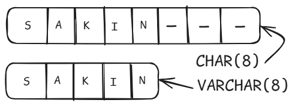

**What is the purpose of a database schema in PostgreSQL?**

Database Schema বলতে আমরা বুঝতে পারি একটা ডাটাবেসের ব্লুপ্রিন্ট বা কাঠামো। আমরা সাধারণত ডাটাবেসের টেবিলগুলোতে বিভিন্ন ধরনের ডাটা স্ট্রাকচারড ওয়েতে স্টোর করি এবং দরকারে তা রিট্রিভ করি। বড় ধরণের এপ্লিকেশনের ক্ষেত্রে এই ডাটাবেসের স্ট্রাকচার অনেক জটিল হওয়ার সম্ভবনা থাকে, তখন ডাটাবেস ম্যানেজ করা অনেকটা কষ্টসাধ্য হয়ে যায়।

    

এই সমস্যা থেকে মুক্ত হতে database schema এর কনসেপ্ট ব্যবহার হয়। একটা ডেটাবেসের টেবিলগুলো তৈরির সময়, সেগুলা কি কি ডাটা স্টোর করবে এবং ডাটাগুলোর ধরণ কি হবে তা এই স্কিমার মাধ্যমে ঠিক করে দেওয়া হয়। আবার বিভিন্ন টেবিলগুলোর মধ্যে সম্পর্ক স্থাপনের জন্য নির্দেশনা দেওয়া হয়, যেমন প্রাইমারি কি ও ফরেইন কি গুলো এবং তাদের মধ্যকার রিলেশন ঠিক করা হয়। তাহলে এই ডাটাবেস ইমপ্লিমেন্ট ও ম্যানেজ করা সহজ থেকে সহজতর হয়।


**Explain the Primary Key and Foreign Key concepts in PostgreSQL.**

আমরা ইন্ডাস্ট্রি লেভেলের প্রজেক্টগুলোতে যখন ডাটাবেস ব্যবহার করি তখন দেখা যায় অনেক সংখ্যক টেবিলের প্রয়োজন হয়। আর এই টেবিলগুলোও নিজেদের মধ্যে ইন্টারকানেক্টেড থাকে। এই ইন্টারকানেক্টিভিটি তৈরি করতে আমাদের সাধারণত দুই ধরণের key প্রয়োজন হয়, যেগুলো হল Primary Key এবং  Foreign Key । 

Primary Key  হল একটি টেবিলের প্রত্যেক সারি এর জন্য ইউনিক আইডেন্টিফায়ার। প্রাইমারি কি সাধারণত একটা কলাম অথবা একাধিক কলামের সেট আকারে ধরা হয়। যখন একটা কলাম এর ডাটা দিয়ে ওই সারিকে নির্দিষ্ট করে আইডেন্টফাই করা যায় না তখন একাধিক কলাম এর দরকার হয়। তবে যদি একাধিক কলামের ব্যবহার হয় তখন তাকে Composite Key ও বলা হয়।

Foreign Key সাধারণত একটি টেবিলের মধে অন্য একটি টেবিলের প্রাইমারি কি কে নির্দেশ করে। ফলে দুইটি টেবিলের মধে সম্পর্ক স্থাপন করা যায় এবং একটা ডাটার সাথে ম্যাচ করে অন্য টেবিল থেকে প্রয়োজনীয় ডাটা রিট্রিভ করা যায়। একটি টেবিলের মধ্যে এক বা একাধিক ফরেইন কি থাকতে পারে আবার নাও থাকতে থাকতে পারে।


উপরের এন্টিটি ডায়াগ্রামে, student_id ও department_id হল দুইটা টেবিলের প্রাইমারি কি এবং department_id এইক্ষেত্রে students টেবিলের জন্য ফরেইন কি। উদাহরণ হিসেবে যদি আমরা একজন স্টুডেন্টের ডিপার্ট্মেন্ট সম্পর্কে জানতে চাই তাহলে তার প্রাইমারি কি student_id দিয়ে তাকে ইউনিকলি আইডেন্টিফাই করতে পারব। এবার department_id ব্যবহার করে আমরা departments টেবিল থেকে তার department_name সহজেই বের করে ফেলতে পারব।


**What is the difference between the `VARCHAR` and `CHAR` data types?**

SQL ভিত্তিক ডাটাবেস এ বিভিন্ন ধরণের ডাটা টাইপ ব্যবহার হয়, যার মধ্যে স্ট্রিং জাতীয় ডাটা স্টোর করতে VARCHAR ও CHAR এই দুই ধরণের ডাটা টাইপ ব্যবহৃত হয়। যদিও এরা একই ধরণের ডাটা স্টোর করে, কিন্তু এদের স্টোর করার টেকনিকের মধ্যে অত্যন্ত গুরুত্বপূর্ণ পার্থক্য বিদ্যমান।

CHAR ডাটাটাইপের ক্ষেত্রে শুরুতেই একটি নির্দিষ্ট সাইজ লিমিট দিয়ে দেওয়া হয়। এই কলামে স্টোর করা সকল ডাটার সাইজ লিমিটের মধ্যে হতে হয় নাহলে স্টোর হয়না। তবে যদি ডাটার সাইজ লিমিটের থেকে ছোট হয় সেক্ষত্রে বাকি যেই অব্যবহৃত সাইজটুকু থাকে তা প্যাডিং হয়ে ঐ কলামেই স্টোর হয়। যা প্রয়োজনের অতিরিক্ত স্টোরেজ ব্যবহার করে এবং ভবিষ্যতে সমস্যা তৈরি করতে পারে।

 

CHAR এর এই সমস্যা নিরসনে VARCHAR ব্যবহার করা হয়। VARCHAR শব্দটি ভেঙে আমরা Variable CHAR ধরতে পারি তাহলে এর মর্মার্থ বুঝতে পারব। যার অর্থ দাঁড়ায় এই ডাটা টাইপের মধ্যে স্টোরেজের ভেরিয়েশন হয়। স্টোরেজ ভেরিয়েশন বলতে আমরা বুঝতে পারি যে স্টোরকৃত ডাটার সাইজ যদি লিমিট থেকে ছোট হয় সেইক্ষেত্রে ডাটার সমপরিমাণ স্টোরেজ স্পেসই ব্যবহৃত হয়। VARCHAR এ CHAR এর মত সম্পূর্ণ ডাটা লিমিট স্পেস ব্যবহৃত হয়না। এক্ষেত্রে আমাদের স্টোরেজ স্পেস প্রয়োজনের অতিরিক্ত ব্যবহৃত হয়না।


**Explain the purpose of the `WHERE` clause in a `SELECT` statement.**

SELECT স্টেটমেন্ট ব্যবহৃত কুয়েরিগুলোর মাধ্যমে আমরা একটা ডেটাবেস থেকে আমাদের প্রয়োজনীয় ডাটা রিট্রিভ করে থাকি। যেমন,

```pgsql
SELECT * FROM STUDENTS;
```

এই স্টেটমেন্টের মাধ্যমে স্টুডেন্ট টেবিলের সব ডাটা রিট্রিভ করা সম্ভব। কিন্তু আমরা যদি সব ডাটা রিট্রিভ না করে একজন নির্দিষ্ট ছাত্রের ডাটা বের করতে চাই সেইক্ষেত্রে এই কুয়েরি স্টেটমেন্ট ব্যবহার করলে সব ছাত্রের ডাটা চলে আসবে এবং পরবর্তীতে সেখান থেকে ঐ ছাত্রের তথ্য আলাদা করতে হবে। যা অত্যন্ত সময় সাপেক্ষ এবং অনেক বেশি প্রসেসিং দরকার হবে। এই সমস্যা থেকে বাঁচতে আমরা WHERE ক্লজ ব্যবহার করতে পারি।

```pgsql
SELECT * FROM STUDENTS WHERE student_id = 2107103 OR score > 76;
```

WHERE ক্লজের পরের অংশে একটা শর্ত দেওয়া হয়। কেবল এই শর্ত পূরণ হইলে সেই ডাটা পাস করা হবে। এক্ষেত্রে কুয়েরিটি রান হলে সবগুলো সারিতে অপারেশন চলবে এবং যেই সারিতে student_id এর ভ্যালু 2107103 পাবে অথবা যেসব সারির score এর মান 76 থেকে বেশি হবে সেইসকল সারি রিটার্ন করা হবে। `=, >, <, in, between` সহ বিভিন্ন রিলেশনাল অপারেটরের মাধ্যমে শর্ত যুক্ত করা এবং `and, or, not` সহ আরও অপারেটর ব্যবহার করে এক বা একাধিক শর্ত যুক্ত করা যেতে পারে।  এইভাবে কোনো একটি নির্দিষ্ট ডাটা একটা ডাটাবেস থেকে রিট্রিভ করা সম্ভব কোনো অতিরিক্ত ও সময় সাপেক্ষ প্রসেসিং ছাড়াই।


**How can you modify data using `UPDATE` statements?**

ডাটাবেসগুলোতে কেবল ডাটা স্টোর ও রিট্রিভ করা ছাড়াও বিভিন্ন ধরণের অপারেশন করা যায় তার মধ্যে অন্যতম হল আপডেট বা পরিবর্তন। এই আপডেট ফাংশনালিটি অনেক বেশি গুরুত্বপূর্ণ হয়ে পরে যখন কোনো স্টোরড ডাটা পরিবর্তন করার প্রয়োজন হয়। যেমন, একজন ছাত্রের ক্ষেত্রে প্রতি সেমিস্টারে তার সিজিপিএ পরিবর্তন হয়। তখন তার পুরাতন সিজিপিএ পরিবর্তন করে নতুন সিজিপিএ স্টোর করার জন্য আমরা এই কুয়েরিটি ব্যবহার করতে পারি।

```pgsql
UPDATE Students SET cgpa = 3.52, phone='01700001111' WHERE student_id = 2107103;
```

এই কুয়েরি স্টেটমেন্টের ক্ষেত্রে দেখা যাচ্ছে, UPDATE কিওয়ার্ডের পরে টেবিলের নাম দিতে হবে যেই টেবিলের ডাটা পরিবর্তন করা হবে। এরপর SET কিওয়ার্ড দিয়ে COLUMN এর নাম এবং সমান চিহ্ন দিয়ে নতুন ভ্যালু দিতে হবে অর্থাৎ এই cgpa কলামের ভ্যালু 3.52 বসবে এবং চাইলে একাধিক কলামের ও তার ভ্যালু কমা দিয়ে আলাদা করে সেট করা যাবে। এরপরে আসবে WHERE ক্লজ যার মাধ্যমে কোন সারি বা ছাত্রের ডাটা পরিবর্তন করা হবে তা সুনির্দিষ্ট করে দিতে হবে। WHERE ক্লজের মাধ্যমে কোনো নির্দিষ্ট ছাত্রকে সিলেক্ট না করলে ঐ টেবিলের সকল ছাত্রের সিজিপিএ ভ্যালু চেঞ্জ করে নতুন ভ্যালু সেট করে দিবে। এভাবেই UPDATE স্টেটমেন্টের মাধ্যমে একটা নির্দিষ্ট সারির নির্দিষ্ট এক বা একাধিক কলামের ডাটা আপডেট করা হয়।
